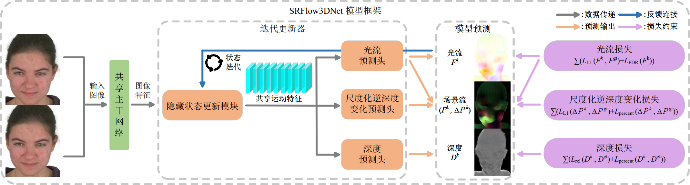

# SRFlow3DNet

Official implementation of:

**SRFlow3DNet: Monocular Facial Scene Flow with Optical Flow Branch Regularization**

---

## Overview

SRFlow3DNet builds upon an iterative optical flow update framework and extends it for scene flow estimation.

In addition to the optical flow prediction head, we introduce:

* a depth prediction head
* a scaled inverse depth change prediction head

By jointly optimizing these components, the model enables end-to-end learning of scene flow from monocular RGB inputs.

---

## Architecture

The model retains the optical flow prediction branch and augments it with depth and scaled inverse depth change heads, enabling unified modeling of 2D motion and 3D geometry.

---

## Key Contributions

* End-to-end monocular RGB scene flow estimation framework
* Unified modeling of optical flow, depth, and depth change
* Optical flow branch with geometry-aware regularization for 2D–3D consistency
* Robust performance under complex facial motion and geometry variation

---

## Relationship to SRFlowNet

SRFlow3DNet extends our optical flow framework:

* **[SRFlowNet](https://github.com/elieZer913/SRFlowNet)**: models 2D optical flow
* **SRFlow3DNet**: models full 3D scene flow

The optical flow branch in SRFlow3DNet builds upon SRFlowNet and provides additional constraints for improving 3D motion estimation.

---

## Dataset

We use the **SRFlow3D dataset**, generated by our pipeline:

👉 [SRFlowCore Repository Link](https://github.com/elieZer913/SRFlowCore)

The dataset provides:

* Optical flow
* Depth
* Scaled inverse depth change

which together enable scene flow supervision.

---

## TODO

* [ ] Release training code
* [ ] Release pretrained models
* [ ] Provide evaluation scripts
* [ ] Add detailed documentation

---

## Acknowledgements

This project builds upon the following works:

* [SKFlow](https://github.com/littlespray/SKFlow)
* [ARFlow](https://github.com/lliuz/ARFlow)

We thank the authors for their excellent contributions.
